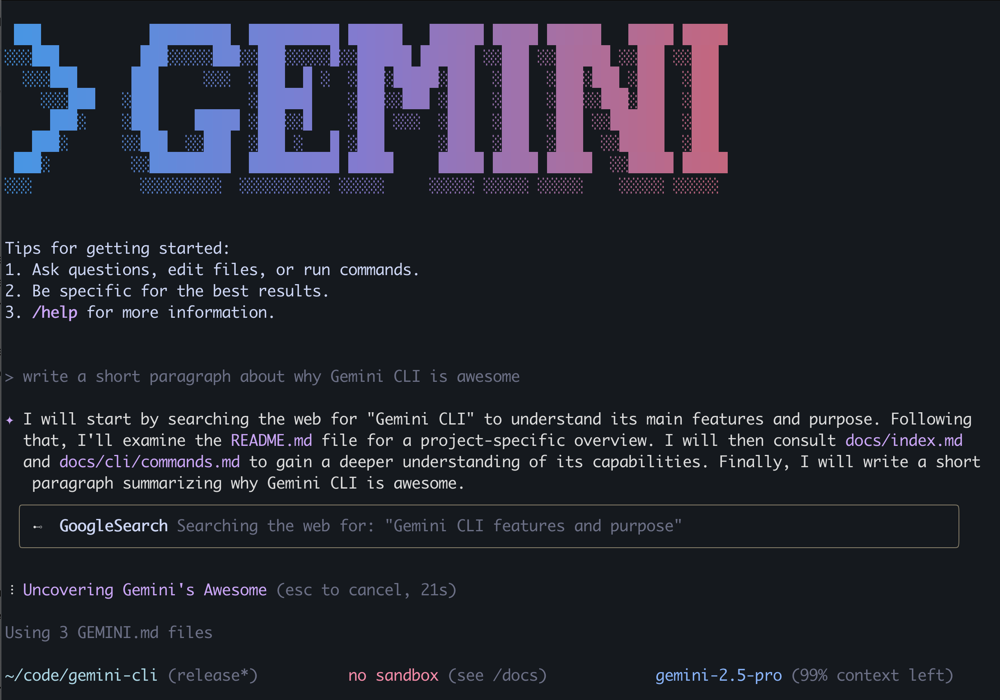

```markdown
# Gemini CLI

[](https://github.com/google-gemini/gemini-cli/actions/workflows/ci.yml)



本仓库包含 Gemini CLI，这是一个命令行 AI 工作流工具，可连接到你的
工具，理解你的代码并加速你的工作流程。

使用 Gemini CLI，你可以：

- 在超过 Gemini 100 万 token 上下文窗口的范围内查询和编辑大型代码库。
- 利用 Gemini 的多模态功能，从 PDF 或草图生成新应用。
- 自动化操作任务，例如查询拉取请求或处理复杂的变基（rebase）。
- 使用工具和 MCP 服务器连接新功能，包括 [使用 Imagen、Veo或 Lyria 生成媒体](https://github.com/GoogleCloudPlatform/vertex-ai-creative-studio/tree/main/experiments/mcp-genmedia)
- 通过内置于 Gemini 的 [Google 搜索](https://ai.google.dev/gemini-api/docs/grounding) 工具为你的查询提供事实依据。

## 快速入门

1. **前提条件：** 确保你已安装 [Node.js 版本 20](https://nodejs.org/en/download) 或更高版本。
2. **运行 CLI：** 在终端中执行以下命令：

   ```bash
   npx https://github.com/google-gemini/gemini-cli
   ```

   或使用以下命令安装：

   ```bash
   npm install -g @google/gemini-cli
   ```

   然后，从任意位置运行 CLI：

   ```bash
   gemini
   ```

3. **选择配色方案**
4. **身份验证：** 出现提示时，使用你的个人 Google 账户登录。这将为你提供每分钟最多 60 次模型请求和每天最多 1,000 次模型请求的权限（使用 Gemini）。

你现在可以使用 Gemini CLI 了！

### 使用 Gemini API 密钥：

Gemini API 提供了免费层级，使用 Gemini 2.5 Pro 可每天进行 [100 次请求](https://ai.google.dev/gemini-api/docs/rate-limits#free-tier)，并可控制所使用的模型，以及通过付费计划访问更高的请求速率限制：

1. 从 [Google AI Studio](https://aistudio.google.com/apikey) 生成密钥。
2. 在终端中将其设置为环境变量。将 `YOUR_API_KEY` 替换为你生成的密钥。

   ```bash
   export GEMINI_API_KEY="YOUR_API_KEY"
   ```

3. （可选）在 API 密钥页面将你的 Gemini API 项目升级到付费计划（将自动解锁 [Tier 1 请求速率限制](https://ai.google.dev/gemini-api/docs/rate-limits#tier-1)）

### 使用 Vertex AI API 密钥：

Vertex AI API 提供了 [免费层级](https://cloud.google.com/vertex-ai/generative-ai/docs/start/express-mode/overview)，使用 Gemini 2.5 Pro 的 Express 模式，可控制所使用的模型，并通过结算账户访问更高的请求速率限制：

1. 从 [Google Cloud](https://cloud.google.com/vertex-ai/generative-ai/docs/start/api-keys) 生成密钥。
2. 在终端中将其设置为环境变量。将 `YOUR_API_KEY` 替换为你生成的密钥，并将 `GOOGLE_GENAI_USE_VERTEXAI` 设置为 true：

   ```bash
   export GOOGLE_API_KEY="YOUR_API_KEY"
   export GOOGLE_GENAI_USE_VERTEXAI=true
   ```

3. （可选）在你的项目中添加结算账户以访问 [更高的使用限制](https://cloud.google.com/vertex-ai/generative-ai/docs/quotas)

有关其他身份验证方法（包括 Google Workspace 账户），请参阅 [身份验证](./docs/cli/authentication.md) 指南。

## 示例

CLI 运行后，你可以从 shell 中开始与 Gemini 交互。

你可以从新目录启动一个项目：

```sh
cd new-project/
gemini
> 请根据我将提供的 FAQ.md 文件编写一个 Gemini Discord 机器人来回答问题
```

或者处理现有项目：

```sh
git clone https://github.com/google-gemini/gemini-cli
cd gemini-cli
gemini
> 请总结昨天所有提交的更改
```

### 后续步骤

- 学习如何 [为源码做贡献或从源码构建](./CONTRIBUTING.md)。
- 探索可用的 **[CLI 命令](./docs/cli/commands.md)**。
- 如果遇到任何问题，请查看 **[故障排除指南](./docs/troubleshooting.md)**。
- 如需更全面的文档，请参阅 [完整文档](./docs/index.md)。
- 查看一些 [热门任务](#热门任务) 以获得更多灵感。
- 查看我们的 **[官方路线图](./ROADMAP.md)**

### 故障排除

如果遇到问题，请前往 [故障排除指南](docs/troubleshooting.md)。

## 热门任务

### 探索新的代码库

首先使用 `cd` 进入一个现有或新克隆的仓库，然后运行 `gemini`。

```text
> 描述该系统架构的主要组成部分。
```

```text
> 当前有哪些安全机制？
```

### 使用你现有的代码

```text
> 实现 GitHub issue #123 的初稿。
```

```text
> 帮我将此代码库迁移到最新版本的 Java。先制定一个计划。
```

### 自动化你的工作流程

使用 MCP 服务器将本地系统工具与企业协作套件集成。

```text
> 创建一个幻灯片演示文稿，展示过去 7 天的 git 历史记录，按功能和团队成员分组。
```

```text
> 创建一个全屏网页应用，用于墙上的展示，显示我们互动最多的 GitHub 问题。
```

### 与你的系统交互

```text
> 将此目录中的所有图像转换为 png 格式，并根据 exif 数据中的日期重命名。
```

```text
> 按支出月份整理我的 PDF 发票。
```

### 卸载

有关卸载说明，请前往 [卸载指南](docs/Uninstall.md)。

## 服务条款和隐私声明

有关适用于你使用 Gemini CLI 的服务条款和隐私声明的详细信息，请参阅 [服务条款和隐私声明](./docs/tos-privacy.md)。
```