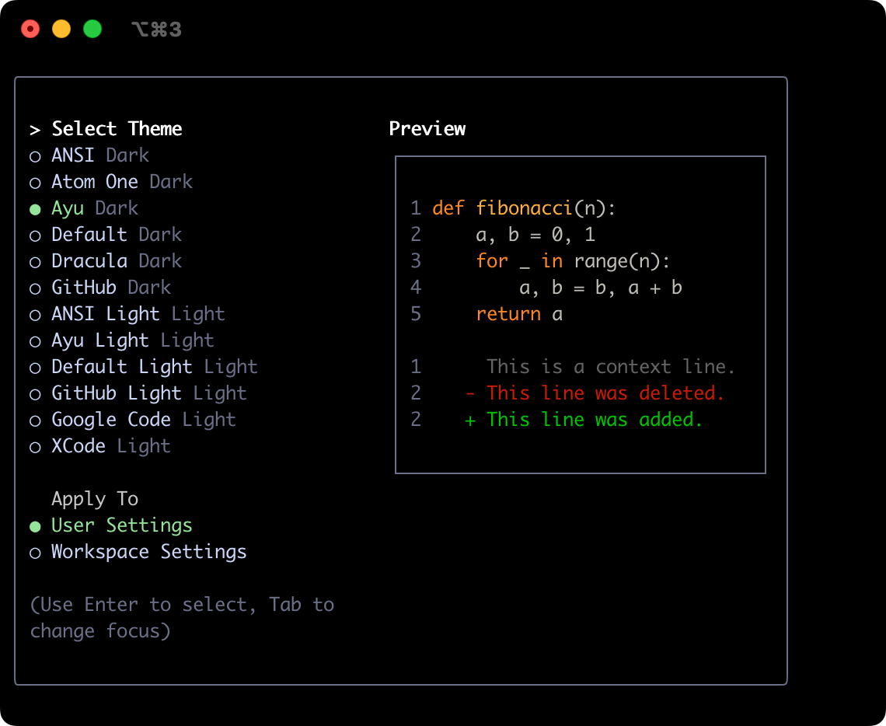
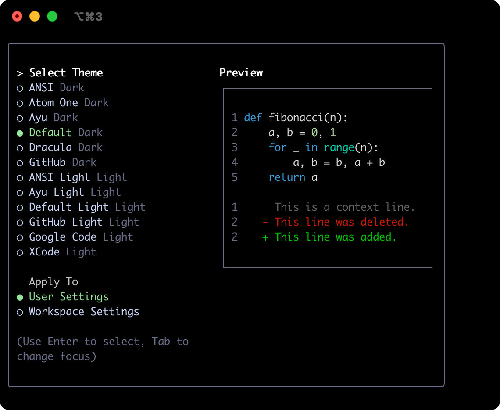

# 主题

Gemini CLI 支持多种主题，用于自定义其配色方案和外观。你可以通过 `/theme` 命令或 `"theme":` 配置设置更改主题以符合你的偏好。

## 可用主题

Gemini CLI 配备了一系列预定义主题，你可以在 Gemini CLI 中使用 `/theme` 命令列出这些主题：

- **暗色主题：**
  - `ANSI`
  - `Atom One`
  - `Ayu`
  - `Default`
  - `Dracula`
  - `GitHub`
- **亮色主题：**
  - `ANSI Light`
  - `Ayu Light`
  - `Default Light`
  - `GitHub Light`
  - `Google Code`
  - `Xcode`

### 更改主题

1. 在 Gemini CLI 中输入 `/theme`。
2. 出现一个对话框或选择提示，列出可用的主题。
3. 使用箭头键选择一个主题。某些界面可能在你选择时提供实时预览或高亮显示。
4. 确认你的选择以应用该主题。

### 主题持久化

所选主题将保存在 Gemini CLI 的 [配置](./configuration.md) 中，以便在不同会话之间记住你的偏好。

## 暗色主题

### ANSI

### Atom OneDark

### Ayu

### Default

### Dracula

### GitHub

## 亮色主题

### ANSI Light

### Ayu Light

### Default Light

### GitHub Light

### Google Code

### Xcode

