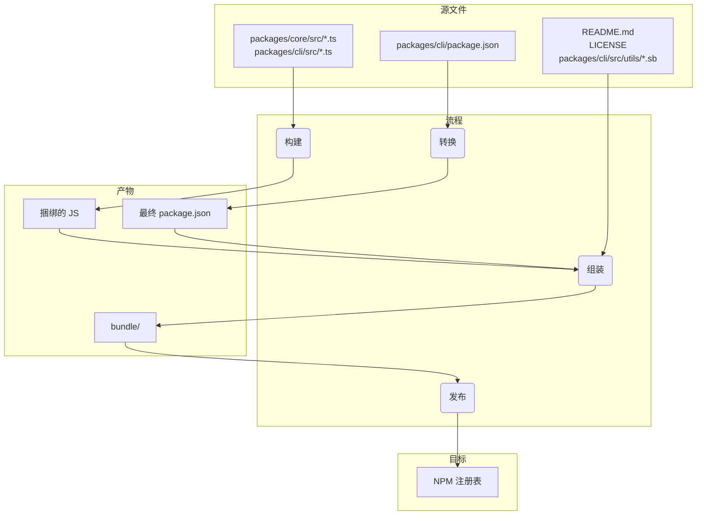

# 包概览

该单体仓库包含两个主要包：`@google/gemini-cli` 和 `@google/gemini-cli-core`。

## `@google/gemini-cli`

这是 Gemini CLI 的主包。它负责用户界面、命令解析以及所有面向用户的功能。

当发布此包时，它会被打包成一个单独的可执行文件。该包包含了所有依赖项，包括 `@google/gemini-cli-core`。这意味着无论用户是通过 `npm install -g @google/gemini-cli` 安装该包，还是直接通过 `npx @google/gemini-cli` 运行它，他们使用的都是这个单一的、自包含的可执行文件。

## `@google/gemini-cli-core`

该包包含与 Gemini API 交互的核心逻辑。它负责发起 API 请求、处理身份验证以及管理本地缓存。

该包不会被打包。当它发布时，会作为一个标准的 Node.js 包发布，并带有自己的依赖项。如果需要，这允许它在其他项目中作为独立包使用。`dist` 文件夹中的所有转译后的 js 代码都会包含在包中。

# 发布流程

该项目遵循结构化的发布流程，以确保所有包都能正确地进行版本控制和发布。该流程设计为尽可能自动化。

## 如何发布

发布通过 [release.yml](https://github.com/google-gemini/gemini-cli/actions/workflows/release.yml) GitHub Actions 工作流进行管理。要手动发布补丁或热修复版本：

1.  导航到仓库的 **Actions** 标签页。
2.  从列表中选择 **Release** 工作流。
3.  点击 **Run workflow** 下拉按钮。
4.  填写所需的输入项：
    - **Version**：要发布的精确版本（例如 `v0.2.1`）。
    - **Ref**：要发布的分支或提交 SHA（默认为 `main`）。
    - **Dry Run**：如要测试工作流而不发布，请保持为 `true`，或设置为 `false` 以执行实际发布。
5.  点击 **Run workflow**。

## 夜间发布

除了手动发布之外，该项目还有一个自动的夜间发布流程，以提供最新的“前沿”版本用于测试和开发。

### 流程

每天 UTC 时间午夜，[Release 工作流](https://github.com/google-gemini/gemini-cli/actions/workflows/release.yml) 会自动运行。它执行以下步骤：

1.  从 `main` 分支检出最新代码。
2.  安装所有依赖。
3.  运行完整的 `preflight` 检查和集成测试。
4.  如果所有测试成功，它会计算下一个夜间版本号（例如 `v0.2.1-nightly.20230101`）。
5.  然后构建并将包发布到 npm，使用 `nightly` dist-tag。
6.  最后，为夜间版本创建一个 GitHub Release。

### 故障处理

如果夜间工作流中的任何步骤失败，它会自动在仓库中创建一个新 issue，并打上 `bug` 和 `nightly-failure` 标签。该 issue 将包含指向失败工作流运行的链接，以便轻松调试。

### 如何使用夜间构建

要安装最新的夜间构建，请使用 `@nightly` 标签：

```bash
npm install -g @google/gemini-cli@nightly
```

我们还运行了一个名为 [release-docker.yml](../.gcp/release-docker.yaml) 的 Google Cloud Build，它会发布与你的发布匹配的沙箱 Docker。一旦服务账户权限处理完毕，它也将移至 GitHub 并与主发布文件合并。

### 发布后操作

工作流成功完成后，你可以在 [GitHub Actions 标签页](https://github.com/google-gemini/gemini-cli/actions/workflows/release.yml) 监控其进度。完成后，你应该：

1.  前往仓库的 [pull requests 页面](https://github.com/google-gemini/gemini-cli/pulls)。
2.  从 `release/vX.Y.Z` 分支创建一个新的 pull request 到 `main`。
3.  审核 pull request（它应该只包含 `package.json` 文件中的版本更新），然后合并它。这将保持 `main` 中的版本是最新的。

## 发布验证

推送新发布后，应进行冒烟测试以确保包按预期工作。这可以通过在本地安装包并运行一组测试来确保它们正常工作来完成。

- `npx -y @google/gemini-cli@latest --version` 用于验证推送是否按预期工作（如果你没有使用 rc 或 dev 标签）
- `npx -y @google/gemini-cli@<release tag> --version` 用于验证标签是否正确推送
- _这会在本地造成破坏_ `npm uninstall @google/gemini-cli && npm uninstall -g @google/gemini-cli && npm cache clean --force &&  npm install @google/gemini-cli@<version>`
- 建议进行基本的冒烟测试，运行几个 LLM 命令和工具以确保包正常工作。我们将在未来对此进行规范化。

## 何时合并版本变更，或不合并？

上述从当前或旧提交创建补丁或热修复发布的模式会使仓库处于以下状态：

1.  标签 (`vX.Y.Z-patch.1`)：该标签正确指向 main 上的原始提交，该提交包含你打算发布的稳定代码。这很关键。任何人检出此标签都会获得已发布的精确代码。
2.  分支 (`release-vX.Y.Z-patch.1`)：该分支在标记提交之上包含一个新提交。该新提交仅包含 package.json 中的版本号变更（以及其他相关文件，如 package-lock.json）。

这种分离是好的。它保持了你的主分支历史干净，没有发布特定的版本升级，直到你决定合并它们。

这是一个关键决策，完全取决于发布的性质。

### 为稳定补丁和热修复合并回来

对于任何稳定补丁或热修复发布，你几乎总是想要将 `release-<tag>` 分支合并回 `main`。

- 为什么？主要原因是更新 main 的 package.json 中的版本。如果你从旧提交发布 v1.2.1 但从未将版本升级合并回来，你的 main 分支的 package.json 仍将显示 "version": "1.2.0"。下一个开始为下一个功能发布（v1.3.0）工作的开发人员将从一个具有错误、旧版本号的代码库分支出去。这会导致混淆，并需要以后手动升级版本。
- 流程：在创建 release-v1.2.1 分支并成功发布包后，你应该打开一个 pull request 将 release-v1.2.1 合并到 main。此 PR 将仅包含一个提交："chore: bump version to v1.2.1"。这是一个干净、简单的集成，使你的 main 分支与最新发布的版本保持同步。

### 不要为预发布（RC、Beta、Dev）合并回来

你通常不会将预发布分支的发布分支合并回 `main`。

- 为什么？预发布版本（例如 v1.3.0-rc.1、v1.3.0-rc.2）本质上是不稳定的，且是临时的。你不希望用一系列发布候选的版本升级污染你的 main 分支历史。main 中的 package.json 应该反映最新的稳定发布版本，而不是 RC。
- 流程：创建 release-v1.3.0-rc.1 分支，执行 npm publish --tag rc，然后...该分支已经完成了它的使命。你可以简单地删除它。RC 的代码已经在 main（或功能分支）上，因此没有功能代码丢失。该发布分支只是一个版本号的临时载体。

## 本地测试和验证：对打包和发布流程的更改

如果你需要测试发布流程而不实际发布到 NPM 或创建公共 GitHub 发布，你可以从 GitHub UI 手动触发工作流。

1.  前往仓库的 [Actions 标签页](https://github.com/google-gemini/gemini-cli/actions/workflows/release.yml)。
2.  点击 "Run workflow" 下拉按钮。
3.  保持 `dry_run` 选项选中（`true`）。
4.  点击 "Run workflow" 按钮。

这将运行整个发布流程，但会跳过 `npm publish` 和 `gh release create` 步骤。你可以检查工作流日志以确保一切按预期工作。

在提交更改之前，本地测试打包和发布流程的任何更改至关重要。这可以确保包能正确发布，并且在用户安装时能按预期工作。

要验证你的更改，你可以执行发布流程的干运行。这将模拟发布流程，但实际上不会将包发布到 npm 注册表。

```bash
npm_package_version=9.9.9 SANDBOX_IMAGE_REGISTRY="registry" SANDBOX_IMAGE_NAME="thename" npm run publish:npm --dry-run
```

此命令将执行以下操作：

1.  构建所有包。
2.  运行所有预发布脚本。
3.  创建将发布到 npm 的包 tarball。
4.  打印将发布的包的摘要。

然后你可以检查生成的 tarball，确保它们包含正确的文件，并且 `package.json` 文件已正确更新。tarball 将在每个包目录的根目录下创建（例如，`packages/cli/google-gemini-cli-0.1.6.tgz`）。

通过执行干运行，你可以确信你对打包流程的更改是正确的，并且包将成功发布。

## 发布深度解析

发布流程的主要目标是从 packages/ 目录获取源代码，构建它，并在项目根目录下的临时 `bundle` 目录中组装一个干净、自包含的包。这个 `bundle` 目录就是实际发布到 NPM 的内容。

以下是关键阶段：

阶段 1：发布前的健全检查和版本控制

- 发生什么：在移动任何文件之前，流程确保项目处于良好状态。这包括运行测试、linting 和类型检查（npm run preflight）。根 package.json 和 packages/cli/package.json 中的版本号将更新为新的发布版本。
- 为什么：这保证了只有高质量、可工作的代码才会被发布。版本控制是标志新发布的第一个步骤。

阶段 2：构建源代码

- 发生什么：packages/core/src 和 packages/cli/src 中的 TypeScript 源代码被编译成 JavaScript。
- 文件移动：
  - packages/core/src/\*_/_.ts -> 编译为 -> packages/core/dist/
  - packages/cli/src/\*_/_.ts -> 编译为 -> packages/cli/dist/
- 为什么：开发期间编写的 TypeScript 代码需要转换为 Node.js 可以运行的普通 JavaScript。核心包首先构建，因为 cli 包依赖于它。

阶段 3：组装最终可发布的包

这是最关键的一个阶段，文件在此阶段被移动和转换为发布最终状态。在项目根目录下创建一个临时的 `bundle` 文件夹来存放最终包内容。

1.  `package.json` 被转换：
    - 发生什么：从 packages/cli/ 读取 package.json，修改后写入根 `bundle`/ 目录。
    - 文件移动：packages/cli/package.json -> （内存中转换）-> `bundle`/package.json
    - 为什么：最终的 package.json 必须不同于开发中使用的。关键变化包括：
      - 移除 devDependencies。
      - 移除工作区特定的 "dependencies": { "@gemini-cli/core": "workspace:\*" }，并确保核心代码直接捆绑到最终的 JavaScript 文件中。
      - 确保 bin、main 和 files 字段指向最终包结构中的正确位置。

2.  JavaScript 捆绑包被创建：
    - 发生什么：来自 packages/core/dist 和 packages/cli/dist 的构建后的 JavaScript 被捆绑成一个单独的可执行 JavaScript 文件。
    - 文件移动：packages/cli/dist/index.js + packages/core/dist/index.js -> （通过 esbuild 捆绑）-> `bundle`/gemini.js（或类似名称）。
    - 为什么：这创建了一个包含所有必要应用代码的单一优化文件。它通过移除核心包作为 NPM 上的单独依赖的需要来简化包，因为其代码现在直接包含在内。

3.  静态和支持文件被复制：
    - 发生什么：不属于源代码但对包正确工作或良好描述至关重要的文件被复制到 `bundle` 目录。
    - 文件移动：
      - README.md -> `bundle`/README.md
      - LICENSE -> `bundle`/LICENSE
      - packages/cli/src/utils/\*.sb（沙箱配置文件）-> `bundle`/
    - 为什么：
      - README.md 和 LICENSE 是任何 NPM 包都应包含的标准文件。
      - 沙箱配置文件（.sb 文件）是 CLI 的沙箱功能运行所需的关键运行时资源。它们必须位于最终可执行文件旁边。

阶段 4：发布到 NPM

- 发生什么：在根 `bundle` 目录内运行 npm publish 命令。
- 为什么：通过在 `bundle` 目录内运行 npm publish，只有我们在阶段 3 中精心组装的文件才会上传到 NPM 注册表。这防止了源代码、测试文件或开发配置被意外发布，从而为用户提供一个干净且最小的包。

文件流摘要



此流程确保最终发布的产物是一个专门构建的、干净且高效的项目表示，而不是开发工作区的直接副本。

## NPM Workspaces

该项目使用 [NPM Workspaces](https://docs.npmjs.com/cli/v10/using-npm/workspaces) 来管理此单体仓库中的包。这通过允许我们在项目根目录管理依赖项和运行跨多个包的脚本，简化了开发。

### 它如何工作

根 `package.json` 文件定义了该项目的工作区：

```json
{
  "workspaces": ["packages/*"]
}
```

这告诉 NPM `packages` 目录内的任何文件夹都是应作为工作区一部分管理的单独包。

### Workspaces 的好处

- **简化的依赖管理**：从项目根目录运行 `npm install` 将安装工作区中所有包的所有依赖项并将它们链接在一起。这意味着你不需要在每个包的目录中运行 `npm install`。
- **自动链接**：工作区内的包可以相互依赖。当你运行 `npm install` 时，NPM 会自动在包之间创建符号链接。这意味着当你对一个包进行更改时，依赖该包的其他包会立即看到这些更改。
- **简化脚本执行**：你可以使用 `--workspace` 标志从项目根目录运行任何包中的脚本。例如，要在 `cli` 包中运行 `build` 脚本，可以运行 `npm run build --workspace @google/gemini-cli`。